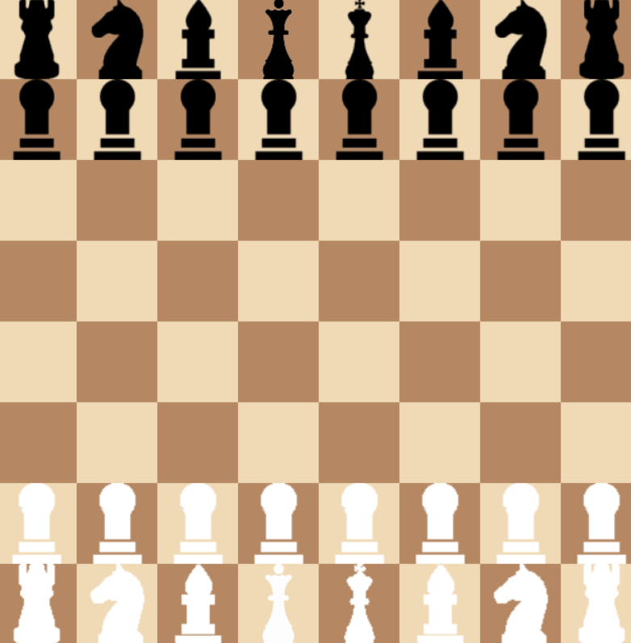
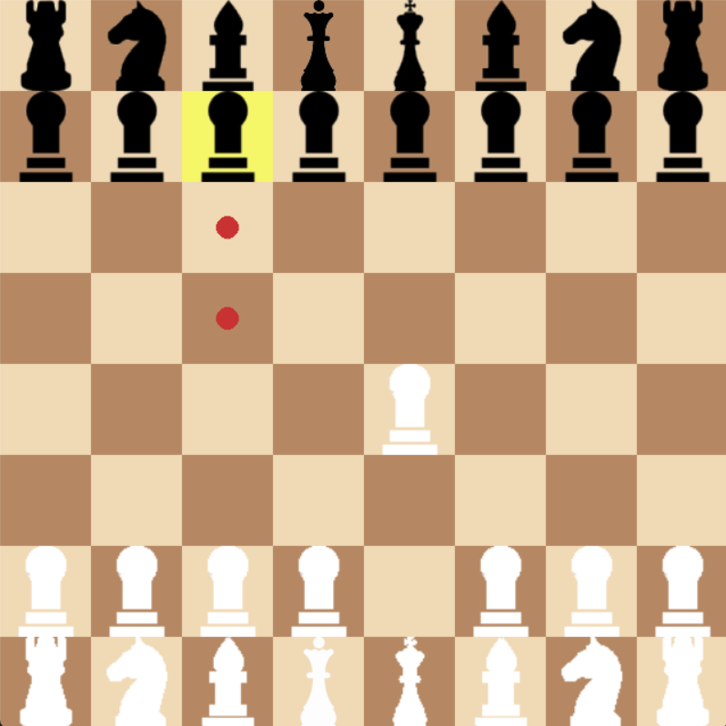

# PYGAME CHESS

**Простой шахматный движок + Pygame UI** — проект, реализующий классическую игру в шахматы с правилами (легальные ходы,
шах, рокировка, en-passant, превращение пешки), визуализацией (спрайты/юниткод), плавной анимацией ходов и звуковыми
эффектами.

---

## Основные возможности

- Полный движок шахмат: генерация легальных ходов с проверкой шаха.
- Специальные правила: рокировка, en-passant, превращение пешки с выбором фигуры (popup).
- UI на Pygame:
    - Обычная иконная/спрайтовая визуализация фигур (поддерживается `assets/sprites/`),
    - Плавная анимация ходов (включая рокировку),
    - Подсветка выбранной клетки и доступных ходов,
- Звуки: move / capture / castle / promotion / check (в `assets/sounds/`).
- Undo (клавиша `U`).

---

## Скриншоты / GIF




---

## Быстрый старт (локально)

1. Клонируй репозиторий:

```bash
git clone https://github.com/Er1argh/pygame_chess
cd pygame_chess
```

2. Рекомендуется создать виртуальное окружение и установить зависимости:

```bash
poetry install
```

3. Структура проекта (кратко):

```
chess_pygame/
├─ assets/
│  ├─ sprites/ # опционально: wK.png, wQ.png, ..., bP.png
│  └─ sounds/  # move.wav, capture.wav, castle.wav, promotion.wav, check.wav
├─ src/
│  ├─ anim.py
│  ├─ config.py
│  ├─ engine.py
│  ├─ game.py
│  ├─ input_handler.py
│  ├─ renderer.py
│  └─ sounds.py
└─ main.py
```

4. Запуск
5.

```bash
poetry run python main.py
```

---

## Требования к ассетам

Если хочешь спрайты и звуки — помести файлы в `assets/`.

**Спрайты (опционально)** — каталог `assets/sprites/`:

- Имена: `wK.png`, `wQ.png`, `wR.png`, `wB.png`, `wN.png`, `wP.png` и `bK.png`, ..., `bP.png`.
- Формат PNG, квадратные изображения — они будут автоматически масштабированы под размер клетки.

**Звуки (опционально)** — каталог `assets/sounds/` (имена должны точно совпадать):

- `move.wav` — обычный ход
- `capture.wav` — взятие
- `castle.wav` — рокировка
- `promotion.wav` — превращение
- `check.wav` — шах

> Примечание: если звуковых/графических файлов нет — приложение корректно отобразит Unicode-символы и проигнорирует
> звук.

---

## Управление

- ЛКМ — выбрать фигуру / сделать ход (клики на popup — выбрать превращение пешки).
- `U` — Undo (откат последнего хода).
- Закрыть окно — выйти.

---

## Архитектура и файлы

Коротко по главным модулям:

- `engine.py` — все классы фигур, `Board`, `Move`, логика легальных ходов и проверка шаха.
- `anim.py` — структуры для анимации (AnimatedMove, MovingPiece).
- `renderer.py` — отрисовка доски, фигур, popup-превращения и координат.
- `sounds.py` — SoundManager: загрузка и воспроизведение эффектов.
- `input_handler.py` — обработка событий pygame -> полезные сигналы (клик на клетку, выбор промоции и т.д.).
- `game.py` — glue: управление состоянием игры, запуск анимаций, применение ходов и работа со звуками.
- `main.py` — точка входа.

---

## Частые проблемы и отладка

- **Звуки не играют**: убедись, что твоя система поддерживает SDL audio, попробуй `pygame.mixer.init()` в REPL. На Linux
  может понадобиться установить `alsa` или `pulseaudio`.
- **Спрайты не отображаются**: проверь пути и имена файлов, формат PNG и корректность прозрачности.
- **Дупликация звука**: проект уже содержит правку, чтобы не проигрывать одинаковый звук дважды (если осталась —
  проверь, что `start_animation_for_move` не вызывает `play` и звук вызывается только при финализации).

---